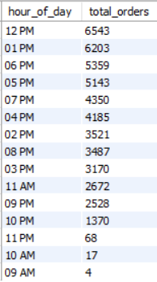

# Project Pizza Restaurant Sales
 SQL & Power Bi Data Analysis

## Table of Contents
- [Project Pizza Restaurant Sales](#project-pizza-restaurant-sales)
  - [Table of Contents](#table-of-contents)
  - [1. Introduction:](#1-introduction)
      - [1.1 Company Background](#11-company-background)
  - [2. PREPARE Phase](#2-prepare-phase)
      - [2.1 Data Used](#21-data-used)
      - [2.2 Accessibility \& Usage of Data](#22-accessibility--usage-of-data)
      - [2.3 Data Limitations \& Integrity](#23-data-limitations--integrity)
    - [2.4 Tools and Methodologies](#24-tools-and-methodologies)
      - [Tools:](#tools)
  - [3. Prepare Phase](#3-prepare-phase)
      - [3.1 Data Preparation](#31-data-preparation)
      - [3.2 Data cleaning](#32-data-cleaning)
      - [3.2 Data Normalization](#32-data-normalization)
      - [3.3 Data Transformation](#33-data-transformation)
  - [4. Exploratory Data Analysis (EDA)](#4-exploratory-data-analysis-eda)
      - [4.1 Business Task](#41-business-task)

## 1. Introduction: 
#### 1.1 Company Background
For the Maven Pizza Challenge, you’ll be playing the role of a BI Consultant hired by Plato's Pizza, a Greek-inspired pizza place in New Jersey. You've been hired to help the restaurant use data to improve operations, and just received the following note:

Welcome aboard, we're glad you're here to help!

Things are going OK here at Plato's, but there's room for improvement. We've been collecting transactional data for the past year, but really haven't been able to put it to good use. Hoping you can analyze the data and put together a report to help us find opportunities to drive more sales and work more efficiently.

Here are some questions that we'd like to be able to answer:

- What days and times do we tend to be busiest?
- How many pizzas are we making during peak periods?
- What are our best and worst-selling pizzas?
- What's our average order value?
- How well are we utilizing our seating capacity? (we have 15 tables and 60 seats)

That's all I can think of for now, but if you have any other ideas I'd love to hear them – you're the expert!
Thanks in advance,

Mario Maven (Manager, Plato's Pizza) 

## 2. PREPARE Phase
#### 2.1 Data Used 
The data source used for this Project is https://www.kaggle.com/datasets/shilongzhuang/pizza-sales. This dataset was downloaded from Kaggle where it was uploaded by Shi Long Zhuang.

#### 2.2 Accessibility & Usage of Data 
This public dataset is completely available on the Maven Analytics website platform where it stores and consolidates all available datasets for analysis in the Data Playground. The specific individual datasets at hand can be obtained at this link below: https://www.mavenanalytics.io/blog/maven-pizza-challenge

#### 2.3 Data Limitations & Integrity
This Pizza Sales dataset contains 12 columns and a total of 48620 records:
- **order_id**: Unique identifier for each order placed by a table.
- **order_details_id**: Unique identifier for each order placed by a table.
- **pizza_id**: Unique key identifier that ties the pizza ordered to its details, like size and price.
- **quantity**: Quantity ordered for each pizza of the same type and size.
- **order_date**: Date the order was placed (entered into the system prior to cooking & serving).
- **order_time**: Time the order was placed (entered into the system prior to cooking & serving).
- **unit_price**: Price of the pizza in USD.
- **total_price**: Unit_price * quantity.
- **pizza_size**: Size of the pizza (Small, Medium, Large, X Large, or XX Large).
- **pizza_type**: Unique key identifier that ties the pizza ordered to its details, like size and price.
- **pizza_ingredients**: Ingredients used in the pizza as shown in the menu (they all include Mozzarella Cheese, even if not specified; and they all include Tomato Sauce, unless another sauce is specified).


The data is clean and well-maintained but somewhat limited:

There is not enough information to conduct an in-depth Inventory Analysis which provides real-time insights into inventory levels, stock movements, and related metrics that help to optimize supply chain operations and minimize costs which can ensure efficient stock levels.

There is also no Customer information for Customer Segmentation Analysis, a process of dividing a company's customers into groups based on shared characteristics to better tailor marketing and sales efforts.

Inefficient inventory management leading to overstocking or wastage.
Difficulty in adjusting pricing dynamically to capture peak demand periods.
Limited understanding of customer behavior, hindering targeted marketing efforts.

### 2.4 Tools and Methodologies
#### Tools:
- MYSQL Workbench is the tool that will be used to create a database Schema for the Pizza Restaurant Sales dataset.
Here we will take the appropriate cleaning procedures if necessary and normalise the data.
Once the data preparation process is taken care of we will undergo Exploratory Data Analysis (EDA) by querying the data to gain valuable insights.

- POWER BI will be used for visualizations and to build a Dashboard

Data analysis was conducted using Python for statistical computations and Tableau for visualizations. The methodologies included correlation analysis, linear regression, and cluster analysis to identify patterns and draw insights.

## 3. Prepare Phase
#### 3.1 Data Preparation 
We start off by creating a new database called **pizza_db** in MYSQL and import the relevant csv file in which all 48620 records were successfully imported.
- One thing to note is that the **order_date** and **order_time** columns are set as **TEXT** datatypes.
- The Second thing to note is that **unit_price** and **total_price** columns are set as **DOUBLE** datatype.

#### 3.2 Data cleaning
As mentioned before the data is clean and well-maintained, there is not duplicates or empty values,
so we begin by standardizing the data:

Firstly we set the **order_date** and **order_time** columns into the standard format MYSQL uses,
and then we correct the datatype from **TEXT** to **DATE/TIME**.

Secondly, we set the **unit_price** and **total_price** columns as **DECIMAL** datatype.

```SQL
-- 2.STANDARDIZE DATA
UPDATE pizza_sales SET order_date = STR_TO_DATE(order_date, '%d/%m/%Y');
ALTER TABLE pizza_sales MODIFY order_date DATE;

UPDATE pizza_sales SET order_time = STR_TO_DATE(order_time, '%H:%i:%s');
ALTER TABLE pizza_sales MODIFY order_time TIME;

ALTER TABLE pizza_sales MODIFY unit_price DECIMAL(10, 2);
ALTER TABLE pizza_sales MODIFY total_price DECIMAL(10, 2);
```
#### 3.2 Data Normalization
WE organize the data into multiple related tables to reduce redundancy and improve data integrity.

1. Order Table: Tracks order information, like date and time.
2. Order Details Table: Links specific pizzas to an order, including quantity and prices.
3. Pizza Table: Stores pizza-specific details such as size, type, and ingredients.

```sql
CREATE TABLE Orders (
    order_id INT NOT NULL PRIMARY KEY AUTO_INCREMENT,
    order_date DATE NOT NULL,
    order_time TIME NOT NULL
);

CREATE TABLE Pizzas (
    pizza_id INT NOT NULL PRIMARY KEY AUTO_INCREMENT,
    pizza_name VARCHAR(50) NOT NULL,
    pizza_size VARCHAR(50) NOT NULL,
    pizza_category VARCHAR(100) NOT NULL,
    pizza_ingredients TEXT NOT NULL
);

CREATE TABLE OrderDetails (
    order_details_id INT NOT NULL PRIMARY KEY AUTO_INCREMENT,
    order_id INT NOT NULL,
    pizza_id INT NOT NULL,
    quantity INT NOT NULL,
    unit_price DECIMAL(10, 2) NOT NULL,
    total_price DECIMAL(10, 2) NOT NULL,
    FOREIGN KEY (order_id) REFERENCES Orders(order_id),
    FOREIGN KEY (pizza_id) REFERENCES Pizzas(pizza_id)
);
```

<details>
<summary>And then insert the data into the corresponding tables:
</summary>

```sql
INSERT INTO Orders (order_date, order_time)
SELECT order_date, order_time
FROM pizza_sales;

INSERT INTO Pizzas (pizza_name, pizza_size, pizza_category, pizza_ingredients)
SELECT pizza_name, pizza_size, pizza_category, pizza_ingredients
FROM pizza_sales;

INSERT INTO OrderDetails (order_id, pizza_id, quantity, unit_price, total_price)
SELECT 
    o.order_id, 
    p.pizza_id, 
    ps.quantity, 
    ps.unit_price,
    ps.total_price
FROM pizza_sales ps
JOIN Orders o ON ps.order_details_id = o.order_id
JOIN Pizzas p ON ps.order_details_id = p.pizza_id;
```

</details>

**Order table:**


**Pizza table:**


**Orderdetails table:**


#### 3.3 Data Transformation
<details>
<summary>In this section we fine-tune the data for visualization
and analysis purposes.
</summary>

```sql
-- Rename values for visualization purposes
UPDATE Pizzas
SET pizza_size =
	CASE
		WHEN pizza_size = 'S' THEN 'Small'
        WHEN pizza_size = 'M' THEN 'Medium'
        WHEN pizza_size = 'L' THEN 'Large'
        WHEN pizza_size = 'XL' THEN 'XLarge'
        WHEN pizza_size = 'XXL' THEN 'XXLarge'
	END;

-- Add days_of_week column to Orders
ALTER TABLE Orders
ADD COLUMN days_of_week VARCHAR(20);

UPDATE Orders
SET days_of_week = DAYNAME(order_date)
WHERE order_id IS NOT NULL;

-- Add times_of_day column to Orders
ALTER TABLE orders
ADD COLUMN times_of_day VARCHAR(20);

UPDATE Orders
SET times_of_day = (
	CASE 
		WHEN order_time BETWEEN '00:00:00' AND '11:59:59' THEN 'Morning' 
		WHEN order_time BETWEEN '12:00:00' AND '14:59:59' THEN 'Lunch'
		WHEN order_time BETWEEN '15:00:00' AND '17:59:59' THEN 'Afternoon' 
		WHEN order_time BETWEEN '18:00:00' AND '20:59:59' THEN 'Dinner'
		WHEN order_time BETWEEN '21:00:00' AND '23:59:59' THEN 'Late Evening' 
	END)
WHERE order_id IS NOT NULL;

# Add day_category column to Orders
ALTER TABLE Orders
ADD COLUMN day_category VARCHAR(20);

UPDATE Orders
SET day_category = CASE
    WHEN days_of_week IN ('Monday', 'Tuesday', 'Wednesday', 'Thursday', 'Friday') THEN 'Weekday'
    WHEN days_of_week IN ('Saturday', 'Sunday') THEN 'Weekend'
END;
```
</details>

## 4. Exploratory Data Analysis (EDA)
#### 4.1 Business Task
In this section we will be focusing on the main task of providing answers to the specific questions given.

1. What days and times do we tend to be busiest?

**Busiest Days Results:**

```sql
SELECT 
    DISTINCT days_of_week,
    COUNT(*) AS total_orders
FROM orders
GROUP BY days_of_week
ORDER BY total_orders DESC;
```


**Insight:**
Friday appears to be the busiest day throughout the year and
Sunday the least busiest day.

Trend: Total Orders progressively increase from the start of the
week, Monday, and peaks Friday-Saturday, and diminishes at the 
end of the week on Sunday.

**Busiest Times Results:**

```sql
SELECT 
	DATE_FORMAT(order_time, '%h %p') AS hour_of_day,
    COUNT(*) AS total_orders
FROM orders
GROUP BY hour_of_day
ORDER BY total_orders DESC;
```



**Insight:**
12 PM is busiest Time throughout the year and
09 AM the least busiest Time (not shown in the image).

Trend: Lunch time (12 PM to 3PM) and Dinner time (6PM to 8PM)
appear to be the most popular hours.

**Busiest Day and time Results:**

```sql
-- busiest times across the week (day + hour breakdown)
SELECT 
    days_of_week, 
    DATE_FORMAT(order_time, '%h %p') AS hour_of_day, 
    COUNT(*) AS total_orders
FROM orders
GROUP BY days_of_week, hour_of_day
ORDER BY total_orders DESC;
```


**Insight:**
Thursday at 12 PM is the busiest Time throughout the year and 
Sunday 10 AM the least busiest Time (not shown in image).

Trend: Regardless of the day, the hours between 12 PM and 1 PM 
are the peak times for pizza orders.

**Busiest Month:**

```sql
SELECT 
    DISTINCT MONTHNAME(order_date) AS months,
    COUNT(*) AS total_orders
FROM orders
GROUP BY months
ORDER BY total_orders DESC;
```


**Insight:**
Although July is the peak month for orders, there doesn't seem 
to be a distinct seasonal pattern, as eight out of the twelve 
months have recorded over 4,000 total orders.

1. How many pizzas are we making during peak periods?

```sql
SELECT
	DISTINCT times_of_day AS peak_periods,
    SUM(od.quantity) AS number_of_pizzas_sold
FROM orders o
JOIN orderdetails od ON o.order_id = od.order_id
GROUP BY times_of_day
ORDER BY number_of_pizzas_sold DESC;
```


**Insight:**
Lunch time (12PM to 3 PM) peaks at the top with 16802 pizzas made.

1. What are our best and worst-selling pizzas?

**Best Selling Pizzas:**

```sql
-- Best selling pizzas
SELECT p.pizza_name, 
       SUM(od.quantity) AS total_sold
FROM orderdetails od
JOIN pizzas p ON od.pizza_id = p.pizza_id
GROUP BY p.pizza_name
ORDER BY total_sold DESC
LIMIT 5;
```


**Insight:**
Although the best selling pizza is the 'Classic Deluxe Pizza'
with 2453 pizzas sold, the top four pizzas have achieved 
comparable sales, each exceeding 4,000 units sold.


**Worst Selling Pizzas:**

```sql
-- Worst selling pizzas
SELECT p.pizza_name, 
       SUM(od.quantity) AS total_sold
FROM orderdetails od
JOIN pizzas p ON od.pizza_id = p.pizza_id
GROUP BY p.pizza_name
ORDER BY total_sold ASC
LIMIT 5;
```


**Insight:**
The 'Brie Carre Pizza' has consistently been the least popular 
option, with just 490 sold over the entire year. Additionally, 
the next four pizzas on the list have also struggled, 
failing to reach the 1,000 pizza sales mark.

1. What's our average order value?

```sql
SELECT 
    ROUND(SUM(od.quantity * od.unit_price) / COUNT(DISTINCT o.order_id), 2) AS average_order_value,
    MIN(unit_price), MAX(unit_price)
FROM orderdetails od
JOIN orders o ON od.order_id = o.order_id;
```


**Insight:**
The Average Order Value is 16.82. This appears to be on the lower
side, especially when the cheapest item is priced at 9.75 and the
most expensive is 35.95, resulting in a difference of 26.20.

It seems that customers typically order one pizza and often 
opt for the more affordable options.

1. How well are we utilizing our seating capacity? 
(we have 15 tables and 60 seats)

To undercover how effectively the seating capacity is being 
utilized without a dedicated dataset to provide this information
we must first must make a few assumptions in order to reach an
accurate estimation.

Secondly, using what we know; July (month), Friday (day), and 
12 PM (hour) are the busiest periods in their respective
segmentations. Therefore, we have picked '2015-07-17' which contains
all the busiest periods in one date.

**Ultilizing Seating Capacity Based On Number Of Table:**

```sql
-- With the assumption each table serves one order at a time.
SELECT 
    order_date,
    DATE_FORMAT(order_time, '%h %p') AS hours,
    COUNT(DISTINCT order_id) AS total_orders,
    '15' AS total_tables,
    (COUNT(DISTINCT order_id) / 15) * 100 AS estimated_utilization
FROM orders
WHERE order_date = '2015-07-17'
	AND DATE_FORMAT(order_time, '%h %p') = '12 PM'
GROUP BY order_date, hours;
```


**Insight:**
During the peak season, only 13 of the 15 tables are currently
in use, amounting to 86%.

**Ultilizing Seating Capacity Based On Average Party Size Per Order:**

```sql
-- With the assumption an average party size per order is 2.5 we can estimate how many seats were occupied:
SELECT 
    order_date,
    DATE_FORMAT(order_time, '%h %p') AS hours,
    COUNT(order_id) AS total_orders,
    '60' AS total_seats,
    (COUNT(order_id) * 2.5) AS estimated_seats_used,
    ((COUNT(order_id) * 2.5) / 60) * 100 AS seat_utilization_percentage
FROM orders
WHERE order_date = '2015-07-17'
	AND DATE_FORMAT(order_time, '%h %p') = '12 PM'
GROUP BY order_date, hours;
```


**Insight:**
Approximately only 54% of seats are being occupied during peak
season, with the assumption that the average group per order 
is 2.5 people.

With 15 tables available and a total of 60 seats, it is
reasonable to conclude that each table accommodates 4 people.
It might be worthwhile to think about introducing additional 
tables with 2 or 3 seats and removing a few tables with 4 seats.
